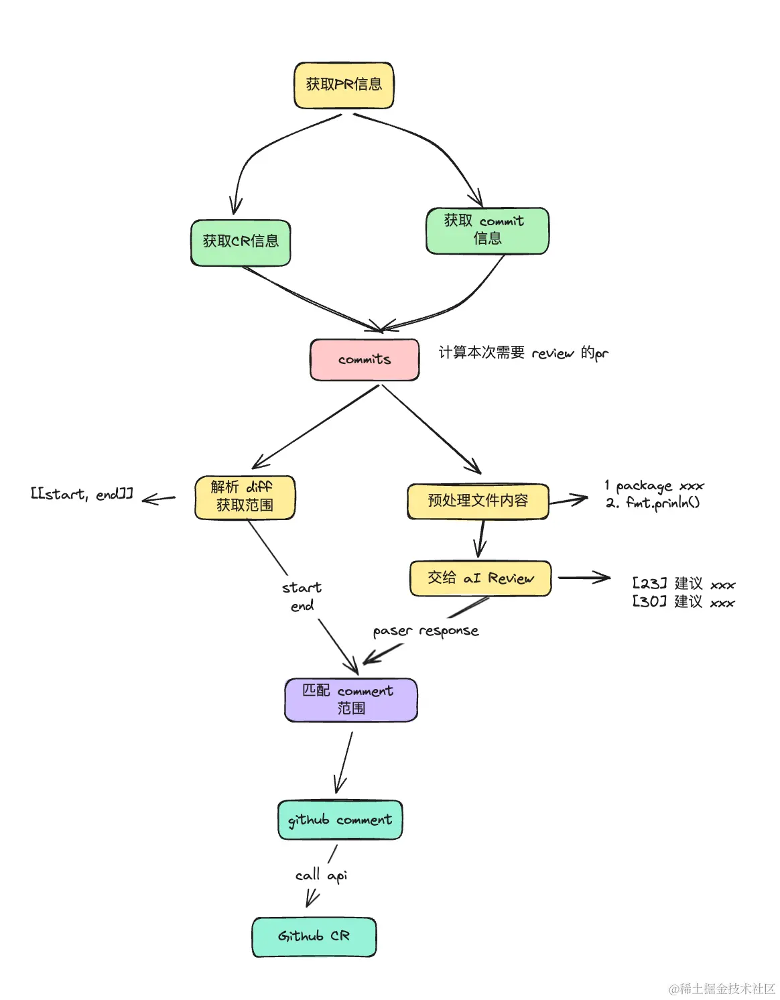

<h1 align="center"> 🧐 ChatGpt Code Review</h1>
<p align="center">
    <em>ChatGpt Code Review 是一个用Golang 编写的 AI code Review 工具，它可以利用AI自动某个Github PR
的 Review ，并 comment 到对应的代码段下。</em>
</p>


[English Document](https://github.com/hanshuaikang/chatgpt-codereview/blob/main/readme_en.md)
## Feature:
- PR 下的 commit 只会 Review 一次
- 基于全文件的 Review 比基于 diff 的质量更高

## Usage

## 配置说明
- `max_file_num`: 如果本次需要 review 的 commit 的文件数大于该配置，则跳过该 commit 的 review， 为 0 则不限制。
- `max_line_num`: 如果待 review 的文件行数大于该配置, 则跳过该 文件 的 review， 为 0 则不限制。
- `max_commit_num`: 如果待 review 的 pr 的 commits 数量大于该配置，则跳过该 pr 的 review， 为 0 则不限制。
- `review_suffixes`: 当指定了 review_suffixes 时, 将只会 review 为 review_suffixes 后缀的文件，为 [] 则不限制。
- `max_concurrency`: 同时 review 的最大并发数, 不设置时为 1

有两种方式使用 ChatGpt Code Review

### 第一种:

作为 command 使用。

1. 创建一个 config.yaml 文件:

```yaml
token: "github token"
owner: "repo owner"
repo: "repo name"
api_key: "openai key"
pr: pr Id
max_file_num: 10
max_line_num: 1000
max_commit_num: 100
max_concurrency: 3
review_suffixes:
  - ".go"
```


```bash
go install github.com/hanshuaikang/chatgpt-codereview@latest

chatgpt-codereview run ./config.yaml
```

2. 引入代码使用

```bash
go get github.com/hanshuaikang/chatgpt-codereview@latest
```

main.go
```golang
package main

import (
	"context"
	"github.com/hanshuaikang/chatgpt-codereview/pkg"
	"github.com/hanshuaikang/chatgpt-codereview/pkg/chatgpt"
	"github.com/hanshuaikang/chatgpt-codereview/pkg/github"
	"os"
)

func main() {
	config := pkg.Config{
		Owner:  "",
		Repo:   "",
		Pr:     0,
		Prompt: "",
		ApiKey: "",
		Token:  "",
		MaxFileNum: 10,
		MaxLineNum: 1000,
		MaxCommitNum: 100,
		MaxConcurrency: 3,
		ReviewSuffixes: []string{".go"},
	}
	
    defaultGptCli := chatgpt.NewGptClient(config)
    githubCli := github.NewGithubCli(config.Token, config.Owner, config.Repo, config.Pr)
    runner, err := pkg.NewCodeReviewRunner(&config, githubCli, defaultGptCli)
	if err != nil {
		os.Exit(1)
	}
	ctx := context.Background()
	err = runner.RunCodeReview(ctx)
	if err != nil {
		os.Exit(1)
	}
}
```

## 附录

实现思路

