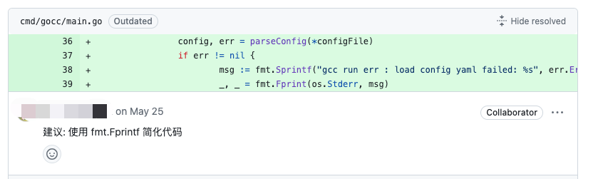

# ChatGpt Code Review
ChatGpt Code Review is an AI code review tool written in Golang. It uses AI to automatically review a specific GitHub PR and comments on the relevant code sections. The effect is as follows:



## Features:
- Commits under a PR will be reviewed only once.
- Review based on the entire file is of higher quality compared to review based on diffs.

## Usage

There are two ways to use ChatGpt Code Review:

### Method 1:

Use as a command.

Create a config.yaml file:
```yaml
token: "github token"
owner: "repo owner"
repo: "repo name"
api_key: "openai key"
pr: pr Id
prompt: ""
```

Install and run the tool:
```yaml
go install github.com/hanshuaikang/chatgpt-codereview@latest
chatgpt-codereview run ./config.yaml
```

### Method 2:
Import the code and use it in your project.

Get the package:
```bash
go get github.com/hanshuaikang/chatgpt-codereview@latest
```

Use it in your project:

```golang
package main

import (
	"context"
	"github.com/hanshuaikang/chatgpt-codereview/pkg"
	"github.com/hanshuaikang/chatgpt-codereview/pkg/chatgpt"
	"os"
)

func main() {
	config := pkg.Config{
		Owner:  "",
		Repo:   "",
		Pr:     0,
		Prompt: "",
		ApiKey: "",
		Token:  "",
	}
	defaultGptCli := chatgpt.NewGptClient(config)
	gpt := chatgpt.NewChatGpt(&config, defaultGptCli)

	ctx := context.Background()
	err := gpt.RunCodeReview(ctx)
	if err != nil {
		os.Exit(1)
	}
}
```